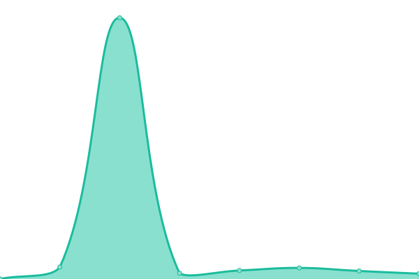
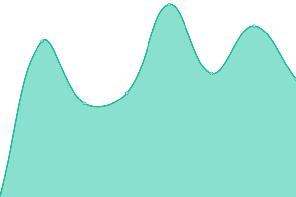

# [📈 Live Status](https://status.nova.onl): <!--live status--> **🟩 All systems operational**

This repository contains the open-source uptime monitor and status page for [snv-dev](https://status.nova.onl), powered by [Upptime](https://github.com/upptime/upptime).

With [Upptime](https://upptime.js.org), you can get your own unlimited and free uptime monitor and status page, powered entirely by a GitHub repository. We use [Issues](https://github.com/snv-dev/upptime/issues) as incident reports, [Actions](https://github.com/snv-dev/upptime/actions) as uptime monitors, and [Pages](https://status.nova.onl) for the status page.

<!--start: status pages-->
<!-- This summary is generated by Upptime (https://github.com/upptime/upptime) -->
<!-- Do not edit this manually, your changes will be overwritten -->
<!-- prettier-ignore -->
| URL | Status | History | Response Time | Uptime |
| --- | ------ | ------- | ------------- | ------ |
|  [NOVA Spektrum](https://novaspektrum.no) | 🟩 Up | [nova-spektrum.yml](https://github.com/snv-dev/upptime/commits/HEAD/history/nova-spektrum.yml) | 

 219ms
     
 | 

<a href="https://status.nova.onl/history/nova-spektrum">100.00%</a>
    

|  [Nor-Shipping](https://nor-shipping.com) | 🟩 Up | [nor-shipping.yml](https://github.com/snv-dev/upptime/commits/HEAD/history/nor-shipping.yml) | 

 208ms
     
 | 

<a href="https://status.nova.onl/history/nor-shipping">100.00%</a>
    

|  [Lillestrøm Lobby](https://lillestromlobby.no) | 🟩 Up | [lillestrom-lobby.yml](https://github.com/snv-dev/upptime/commits/HEAD/history/lillestrom-lobby.yml) | 

 186ms
     
 | 

<a href="https://status.nova.onl/history/lillestrom-lobby">100.00%</a>
    

|  [Oslo Motor Show](https://oslomotorshow.no) | 🟩 Up | [oslo-motor-show.yml](https://github.com/snv-dev/upptime/commits/HEAD/history/oslo-motor-show.yml) | 

 2113ms
     
 | 

<a href="https://status.nova.onl/history/oslo-motor-show">100.00%</a>
    

|  [Camp Villmark](https://campvillmark.no) | 🟩 Up | [camp-villmark.yml](https://github.com/snv-dev/upptime/commits/HEAD/history/camp-villmark.yml) | 

 2086ms
     
 | 

<a href="https://status.nova.onl/history/camp-villmark">100.00%</a>
    

|  [Oslo Design Fair](https://oslodesignfair.no) | 🟩 Up | [oslo-design-fair.yml](https://github.com/snv-dev/upptime/commits/HEAD/history/oslo-design-fair.yml) | 

 2619ms
     
 | 

<a href="https://status.nova.onl/history/oslo-design-fair">100.00%</a>
    

|  [NOVA Talks](https://novatalks.no) | 🟩 Up | [nova-talks.yml](https://github.com/snv-dev/upptime/commits/HEAD/history/nova-talks.yml) | 

 718ms
     
 | 

<a href="https://status.nova.onl/history/nova-talks">100.00%</a>
    

|  [Hagemessen](https://hagemessen.no) | 🟩 Up | [hagemessen.yml](https://github.com/snv-dev/upptime/commits/HEAD/history/hagemessen.yml) | 

 2091ms
     
 | 

<a href="https://status.nova.onl/history/hagemessen">100.00%</a>
    

|  [Agroteknikk](https://agroteknikk.no) | 🟩 Up | [agroteknikk.yml](https://github.com/snv-dev/upptime/commits/HEAD/history/agroteknikk.yml) | 

 2940ms
     
 | 

<a href="https://status.nova.onl/history/agroteknikk">100.00%</a>
    

|  [Transport & Logistikk](https://transport-logistikk.no) | 🟩 Up | [transport-and-logistikk.yml](https://github.com/snv-dev/upptime/commits/HEAD/history/transport-and-logistikk.yml) | 

 856ms
     
 | 

<a href="https://status.nova.onl/history/transport-and-logistikk">100.00%</a>
    

|  [Park og anleggsmessen](https://poga.no) | 🟩 Up | [park-og-anleggsmessen.yml](https://github.com/snv-dev/upptime/commits/HEAD/history/park-og-anleggsmessen.yml) | 

 1901ms
     
 | 

<a href="https://status.nova.onl/history/park-og-anleggsmessen">100.00%</a>
    

|  [Automessen](https://automessen.no) | 🟩 Up | [automessen.yml](https://github.com/snv-dev/upptime/commits/HEAD/history/automessen.yml) | 

 676ms
     
 | 

<a href="https://status.nova.onl/history/automessen">100.00%</a>
    

|  [UMAMI Arena](https://umamiarena.no) | 🟩 Up | [umami-arena.yml](https://github.com/snv-dev/upptime/commits/HEAD/history/umami-arena.yml) | 

 173ms
     
 | 

<a href="https://status.nova.onl/history/umami-arena">100.00%</a>
    

|  [MC-messen](https://mcmessen.no) | 🟩 Up | [mc-messen.yml](https://github.com/snv-dev/upptime/commits/HEAD/history/mc-messen.yml) | 

 660ms
     
 | 

<a href="https://status.nova.onl/history/mc-messen">100.00%</a>
    

|  [Dyr for Alle](https://dyrforalle.no) | 🟩 Up | [dyr-for-alle.yml](https://github.com/snv-dev/upptime/commits/HEAD/history/dyr-for-alle.yml) | 

 1844ms
     
 | 

<a href="https://status.nova.onl/history/dyr-for-alle">100.00%</a>
    

|  [Oslo Dog Show](https://oslodogshow.no) | 🟩 Up | [oslo-dog-show.yml](https://github.com/snv-dev/upptime/commits/HEAD/history/oslo-dog-show.yml) | 

 2103ms
     
 | 

<a href="https://status.nova.onl/history/oslo-dog-show">100.00%</a>
    

|  [Spektrumkvarteret](https://spektrumkvarteret.no) | 🟩 Up | [spektrumkvarteret.yml](https://github.com/snv-dev/upptime/commits/HEAD/history/spektrumkvarteret.yml) | 

 692ms
     
 | 

<a href="https://status.nova.onl/history/spektrumkvarteret">100.00%</a>
    

|  [Lillestrøm NXT](https://lillestromnxt.no) | 🟩 Up | [lillestrom-nxt.yml](https://github.com/snv-dev/upptime/commits/HEAD/history/lillestrom-nxt.yml) | 

 681ms
     
 | 

<a href="https://status.nova.onl/history/lillestrom-nxt">100.00%</a>
    

|  [NOVA Studios](https://novastudios.no) | 🟩 Up | [nova-studios.yml](https://github.com/snv-dev/upptime/commits/HEAD/history/nova-studios.yml) | 

 1555ms
     
 | 

<a href="https://status.nova.onl/history/nova-studios">100.00%</a>
    

|  [NOVA Spektrum Design](https://novaspektrumdesign.no) | 🟩 Up | [nova-spektrum-design.yml](https://github.com/snv-dev/upptime/commits/HEAD/history/nova-spektrum-design.yml) | 

 235ms
     
 | 

<a href="https://status.nova.onl/history/nova-spektrum-design">100.00%</a>
    

|  [NOVA Konsert](https://novakonsert.no) | 🟩 Up | [nova-konsert.yml](https://github.com/snv-dev/upptime/commits/HEAD/history/nova-konsert.yml) | 

 1461ms
     
 | 

<a href="https://status.nova.onl/history/nova-konsert">100.00%</a>
    

<!--end: status pages-->

[**Visit our status website →**](https://status.nova.onl)

## 📄 License

- Powered by: [Upptime](https://github.com/upptime/upptime)
- Code: [MIT](./LICENSE) © [Anand Chowdhary](https://anandchowdhary.com), supported by [Pabio](https://pabio.com)
- Data in the `./history` directory: [Open Database License](https://opendatacommons.org/licenses/odbl/1-0/)
